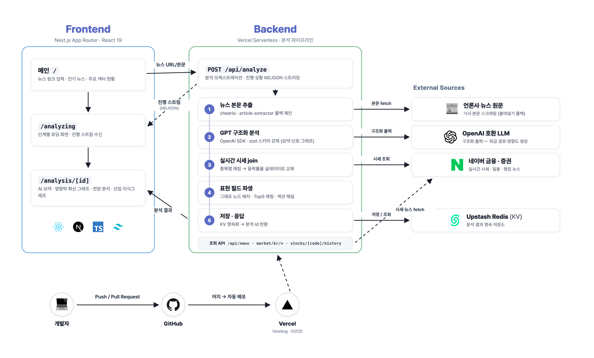

## ✨ 프로젝트 소개

많은 금융 서비스의 뉴스 페이지에서는 기사 본문만 보여주거나, "뉴스 ↔ 관련 종목"의 단순 연결만을 제공해요.

**수혜주.com**은 투자자들에게 뉴스 요약과 함께 **관련 산업이 다른 산업들과 어떻게 연결되어 있고, 서로 어떤 영향을 주고받는지**를 쉽게 파악할 수 있는 정보를 제공해요. 이를 통해 투자자가 거시안적 관점으로 금융시장을 해석하고, 시장이 주목하지 않은 **다음 수혜 산업**을 먼저 발견할 수 있게 도와줘요.

https://suhyeju-com.vercel.app

## 🚀 주요 기능

### 1. 뉴스 링크 분석 파이프라인

메인 화면에 뉴스 링크를 입력하거나 목록의 뉴스를 클릭하면 **본문 추출 → AI 분석 → 파급 효과 분석 결과 제공**의 파이프라인이 실행돼요. 

### 2. 영향력 확산 그래프

뉴스에서 이야기하는 이슈가 **1·2·3차 파급 산업으로 번지는 경로**를 그래프로 표시해 줘요.
 
산업 노드 간 연결선에 마우스를 올리면 해당 산업끼리 영향을 주고받는 근거와 관련 뉴스를 확인할 수 있어요.
 
또한, 산업 노드에 마우스를 올리면 해당 산업의 TOP 5 종목과, 뉴스 발행일 기준 특정 종목이 최대 얼마나 오르고 내렸는지 실제 추이를 확인할 수 있어요.

### 3. 산업 지식그래프

이슈와 관련된 **섹터·기업의 관계망**을 인터랙티브 그래프로 탐색할 수 있어요. 사이드바에서 노드별 연결 관계를 확인하고, 전체 보기 페이지에서 관계망 전체를 크게 볼 수 있어요.

### 4. 전망 분석

분석한 뉴스와 관련 기사/리포트/애널리스트 자료들을 종합해 **긍정 신호와 주의 신호**를 중립적인 관점에서 제시해요.

## 🧩 시스템 아키텍처

### **기술 스택**

| 분류     | 스택                                                                                                                                 |
| -------- | ------------------------------------------------------------------------------------------------------------------------------------ |
| Frontend | Next.js 16 (App Router · Turbopack), React 19, TypeScript, Tailwind CSS v4, shadcn/ui, TanStack Query                                |
| 시각화   | SVG 노드 그래프(확산 그래프), Cytoscape.js · d3-force(지식그래프), Canvas(파티클·주가 차트)                                          |
| AI       | OpenAI SDK 구조화 출력(zod 스키마 강제), mock 폴백(`MOCK_ANALYZE`)                                                                   |
| 데이터   | 네이버 금융·증권(시세/일봉/랭킹 뉴스), cheerio + @extractus/article-extractor(본문 추출)                                             |
| Infra    | Vercel(호스팅·Analytics), Upstash Redis(KV), Google Analytics 4                                                                      |
| DX       | pnpm workspace 모노레포(`apps/web` 중심, `apps/api`·`apps/extension`은 확장 자리), husky + commitlint + lint-staged, Playwright 검증 |

## 🫶🏻 팀 소개

<table align="center">
  <tr>
    <th><a href="https://github.com/minsuhan1">한민수</a></th>
    <th><a href="https://github.com/wogus216">권재현</a></th>
    <th><a href="https://github.com/joshmoon827">문주호</a></th>
    <th><a href="https://github.com/laneyson">laneyson</a></th>
    <th><a href="https://github.com/h1un">h1un</a></th>
  </tr>
  <tr>
    <td></td>
    <td></td>
    <td></td>
    <td></td>
    <td></td>
  </tr>
  <tr align="center">
    <td>PL Frontend</td>
    <td>Backend</td>
    <td>Frontend DevOps</td>
    <td>Frontend</td>
    <td>Frontend</td>
  </tr>
</table>
