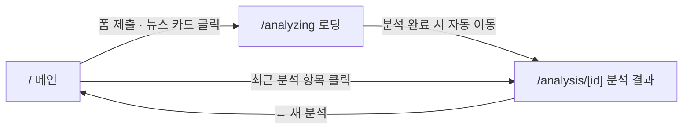
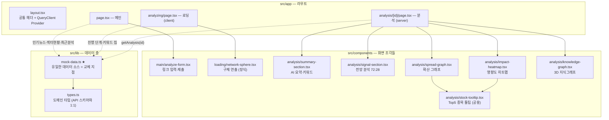
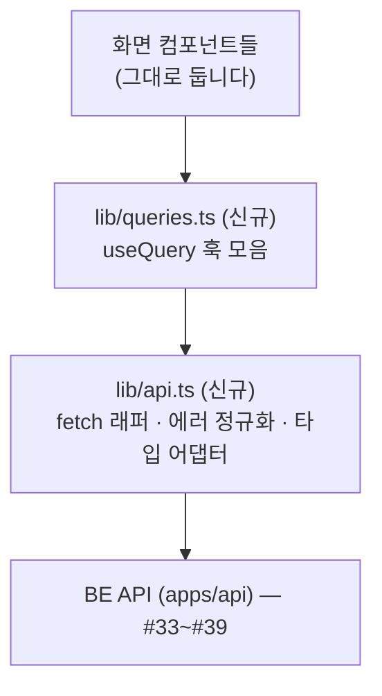

# FE 연동 가이드 — 프로토타입에서 실데이터까지

이 문서는 **API 연동·에러 처리·상태관리·캐싱**을 담당하는 개발자를 위한 안내서입니다.

화면과 기본 핸들러는 이미 준비되어 있습니다. 현재 데이터는 모두 `src/lib/mock-data.ts`에서 읽고 있으므로, 이 파일의 export를 실제 API 호출로 교체하면 연동이 완료되도록 구성했습니다.

컴포넌트 내부 로직과 마크업은 대부분 그대로 두고, 데이터 출처만 바꾸는 작업으로 보면 됩니다.

**권장 순서**

1. §1~§2로 전체 구조를 먼저 확인한다.
2. §3에서 데이터와 화면의 연결을 본다.
3. §4 순서대로 API로 교체한다.
4. 문제를 만나면 §6을 먼저 확인한다.

함께 보면 좋은 문서: `PRODUCT.md`(제품 목적) · `DESIGN.md`(디자인 시스템, UI 수정 시 필독) · `docs/frontend-architecture.md`(폴더 구조 설명)

---

## 1. 프로젝트 한눈에 보기

### 실행

```bash
pnpm install          # 저장소 루트에서
cd apps/web
pnpm dev              # http://localhost:3000
```

메인에서 아무 링크나 붙여넣고 **분석하기**를 누르면 `로딩 → 분석 결과` 흐름을 확인할 수 있습니다. 현재는 어떤 링크를 넣어도 같은 mock 결과가 나옵니다. 자세한 내용은 §6을 참고하세요.

### 스택

| 기술                               | 상태                         | 참고                                                                                            |
| ---------------------------------- | ---------------------------- | ----------------------------------------------------------------------------------------------- |
| Next.js 16 (App Router) + React 19 | 사용 중                      | 라우트는 `src/app/`                                                                             |
| Tailwind CSS v4                    | 사용 중                      | 색·radius 토큰은 `globals.css`의 `:root`에 정의 (다크 단일 테마)                                |
| shadcn/ui                          | 사용 중                      | `src/components/ui/*`                                                                           |
| **TanStack Query v5**              | **세팅만 완료, 아직 미사용** | `src/app/providers.tsx`에 QueryClient가 설정되어 있습니다. 바로 `useQuery`를 사용할 수 있습니다 |
| **zustand**                        | 설치만 됨, 미사용            | 클라이언트 전역 상태가 필요할 때 사용하세요 (§4-2 참고)                                         |

---

## 2. 코드가 어떻게 생겼나요

화면은 세 개입니다. 사용자는 이렇게 이동합니다:



코드 구조는 아래와 같습니다. 점선 화살표는 이 문서에서 바꿔야 하는 데이터 흐름입니다.



핵심은 두 가지입니다.

- **`types.ts`가 계약입니다.** 컴포넌트는 이 타입만 바라보게 두고, BE 응답이 다르면 데이터 층에서 변환하세요.
- 장식 컴포넌트(파티클 배경, 구체)는 데이터와 무관하므로 별도 수정이 필요하지 않습니다.

---

## 3. 데이터 소스는 어디에 매핑되나요

`mock-data.ts`의 export를 API 엔드포인트별 응답과 1:1로 대응시켜 두었습니다. 아래 표의 각 행이 교체 단위입니다. API 명세는 GitHub 이슈 **#33~#39**를 기준으로 보면 됩니다.

| mock export                            | 어느 화면의 무엇                      | 타입                         | 대응 API                                               |
| -------------------------------------- | ------------------------------------- | ---------------------------- | ------------------------------------------------------ |
| `popularNews`                          | 메인 — 인기 뉴스 카드 4개             | `NewsItem[]`                 | **#33**                                                |
| `sectorOverview`                       | 메인 — 주요 섹터 현황 8칸             | `SectorChange[]`             | **#34**                                                |
| `recentAnalyses`                       | 메인 — 최근 분석 내역                 | `RecentAnalysis[]`           | 미정 (§4-2에 제안 있음)                                |
| `analysisSteps`                        | 로딩 — 5단계 체크리스트 문구          | `AnalysisStep[]`             | 상태 폴링으로 대체 (§4-4)                              |
| `floatingChips`                        | 로딩 — 떠다니는 키워드 칩             | `FloatingChip[]`             | #36의 키워드 재사용 가능                               |
| `analysisResult.summary` 등            | 분석 — AI 요약·키워드·관련 섹터       | `AnalysisResult`             | **#36**                                                |
| `analysisResult.goodSignal/warnSignal` | 분석 — 전망 분석(좋은/주의 신호)      | `SignalGroup`                | **#37**                                                |
| `analysisResult.spreadNodes/Edges`     | 분석 — 확산 그래프 (노드·연결선·근거) | `SpreadNode[]` 등            | **#38**                                                |
| `analysisResult.heatmap`               | 분석 — 영향도 히트맵                  | `HeatmapCell[]`              | **#39**                                                |
| `analysisResult.knowledgeNodes/Edges`  | 분석 — 3D 지식그래프                  | `KnowledgeNode[]` 등         | 이슈 미생성 (F-12)                                     |
| `analysisResult.topStocks`             | 그래프·히트맵 hover 시 Top5 종목 툴팁 | `Record<string, TopStock[]>` | **#35**                                                |
| `getAnalysis(id)`                      | 분석 페이지 전체 데이터               | `AnalysisResult`             | BE가 통합 응답을 주면 **이 함수 하나만** 바꾸면 됩니다 |

---

## 4. 연동 작업, 이 순서를 추천해요

새로 추가할 파일은 두 개입니다.



### 4-1. 준비: `lib/api.ts` 만들기

작은 `fetch` 래퍼 하나로 시작하면 충분합니다.

- baseURL은 환경변수(`NEXT_PUBLIC_API_URL`)로 두고, `.env` 규약은 INFRA-01(#10)을 따릅니다.
- HTTP 에러는 status와 message를 담은 Error로 통일해 throw하면, 쿼리 훅과 `error.tsx`에서 같은 방식으로 처리할 수 있습니다.
- BE 응답이 `types.ts`와 다르면 이 단계에서 변환합니다.

### 4-2. 몸풀기: 메인 페이지부터 (#33, #34)

가장 단순한 목록 두 개부터 시작하면 됩니다.

- `lib/queries.ts`에 `usePopularNews()`, `useSectorOverview()` 훅을 만들고, 메인의 두 섹션을 client 컴포넌트로 분리해 훅을 연결하세요.
  - queryKey 제안: `['news', 'popular']` · `['sectors']`
  - staleTime 제안: 뉴스 5분 / 섹터 60초. 섹터에 `refetchInterval: 60_000`을 주면 헤더의 "실시간" 문구가 진짜가 됩니다.
- `recentAnalyses`는 서버 API가 아직 없으므로, **zustand + persist(localStorage)** 로 클라이언트에 저장하는 방식을 권장합니다. 분석 완료 시마다 추가하면 됩니다.
- SSR이 필요해지면 그때 `prefetchQuery` + `HydrationBoundary`를 도입해도 늦지 않습니다.

### 4-3. 핵심: 분석 페이지 (#35~#39)

데이터 양은 많지만 구조는 단순합니다. 대부분 `getAnalysis(id)` 한 곳으로 모입니다.

- BE가 **통합 응답**(#36~#39를 한 번에)을 준다면 `getAnalysis`를 async fetch로 바꾸고 페이지 호출에 `await`만 붙이면 됩니다. 결과가 불변이라면 클라이언트 쿼리에서는 `staleTime: Infinity`가 적절합니다.
- 엔드포인트가 분리되어 나오면 섹션별 훅(`useAnalysisSummary(id)` 등)으로 나누고, 기존 props 형태를 유지한 채 전달하세요. UI는 그대로 동작합니다.

### 4-4. 로딩 페이지: 타이머 → 진짜 진행 상태

현재 로딩 화면은 `STEP_INTERVAL_MS` 타이머로 5단계를 흉내 내고 있습니다. 이 부분을 실제 상태로 바꾸면 됩니다.

1. 폼 제출 시: `analyze-form.tsx`에서 `POST /api/analysis`(URL 제출) → 응답의 `id`를 받아 `/analyzing?id=...`로 이동
2. 로딩 화면: `useAnalysisStatus(id)`를 `refetchInterval: 1500` 정도로 폴링 → 응답의 단계 인덱스를 기존 `done` state에 넣어 주면 **렌더 로직은 수정 없이** 그대로 살아납니다
3. status가 `complete`이면 `/analysis/[id]`로 이동하고, `failed`이면 §4-5의 에러 UI로 보냅니다.

### 4-5. 에러 핸들링 (현재 미구현)

- 라우트별 `error.tsx` / `not-found.tsx`를 추가하세요 (`app/`, `app/analysis/[id]/`). 다크 토큰을 쓰고, "다시 시도"(= `reset()`)와 "새 분석으로" 링크를 함께 두면 됩니다.
- 분석 실패는 로딩 화면 안에서 처리합니다. 실패한 단계에 표시를 남기고 재시도/메인 복귀 버튼을 보여 주세요.
- 아직 구현하지 않은 기능의 버튼은 무반응 대신 **「준비중입니다」** 를 표시합니다 (`docs/proposal/14`).

---

## 5. 그대로 지켜 주세요 (회귀 방지)

데이터를 교체한 뒤 아래 항목은 한 번씩 확인하세요.

**인터랙션 (전부 이미 구현되어 있습니다)**

- 메인: 폼 제출(Enter/버튼 — 빈 입력이면 입력창 포커스), 뉴스 카드 클릭 → 분석, 최근 분석 클릭 → 결과
- 분석: 연결선 hover → 근거·출처 툴팁 / 노드·히트맵 셀 hover → Top5 종목 툴팁 / 지식그래프 드래그 회전 + 자동 회전 + 줌 버튼 / 원문 보기 → 새 탭

**디자인 규칙 (자세한 근거는 `DESIGN.md`)**

- 긍정 = **레드**, 부정 = **그린** (한국 관례, 서구와 반대) — 범례와 +/− 부호를 항상 함께
- 색·radius는 토큰으로만 (hex 하드코딩 금지), `ink-dim`(#5b6474)은 텍스트에 쓰지 않기
- 애니메이션은 transform/opacity만 (진행 바가 `scaleX`인 이유), `prefers-reduced-motion` 대응 유지

UI를 수정했다면 마지막에 한 번:

```bash
npx impeccable detect apps/web/src   # 현재 0건 — 이 상태를 유지해 주세요
```

---

## 6. 미리 알려드리는 "이거 왜 이래요?" 목록

작업 중 마주칠 수 있는 의도된 프로토타입 특성입니다.

| 증상                                         | 이유                                                                                                                              |
| -------------------------------------------- | --------------------------------------------------------------------------------------------------------------------------------- |
| 어떤 링크를 넣어도 같은 분석 결과가 나와요   | `getAnalysis(id)`가 id를 무시하고 같은 mock을 반환합니다. 연동하면 해결됩니다                                                     |
| 최근 분석 3건이 전부 같은 페이지로 가요      | 같은 이유입니다. 현재 mock id가 `hbm4` 하나뿐입니다                                                                               |
| 로딩 화면 뉴스 제목이 항상 같아요            | `analysisResult.title`이 고정값입니다. 제출한 뉴스 제목으로 바꿔 주세요                                                           |
| 지식그래프에 three.js가 없네요?              | 순수 SVG + 원근 투영으로 구현했습니다. 노드가 크게 늘기 전까지는 충분합니다                                                       |
| 히트맵 배치가 하드코딩이에요                 | 목업 비율 고정 레이아웃(`LAYOUT` 상수)입니다. 섹터 구성이 동적이면 weight 기반 treemap으로 교체하세요                             |
| Tailwind로 애니메이션 duration이 안 바뀌어요 | `globals.css`의 `.animate-*`가 무레이어 CSS라 Tailwind 유틸리티보다 우선합니다. 인라인 style을 쓰세요 (`network-sphere.tsx` 참고) |

---

문서와 코드가 다르게 느껴지는 부분이 있으면 알려 주세요. 필요한 부분은 바로 수정하겠습니다.

구조보다 더 중요한 것은 `types.ts` 계약과 §5의 규칙입니다. 이 둘만 유지되면 화면은 그대로 동작합니다.
